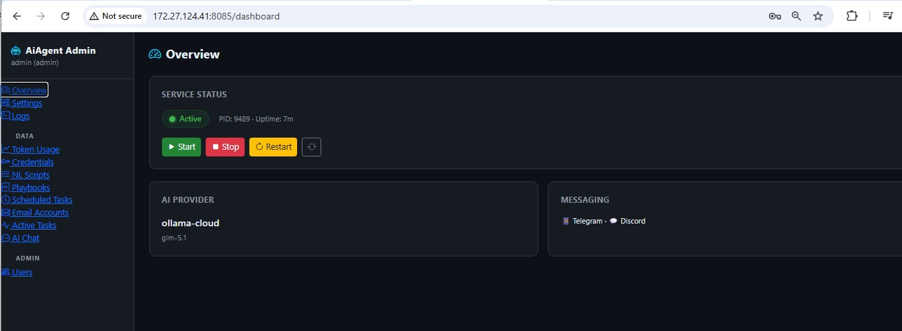
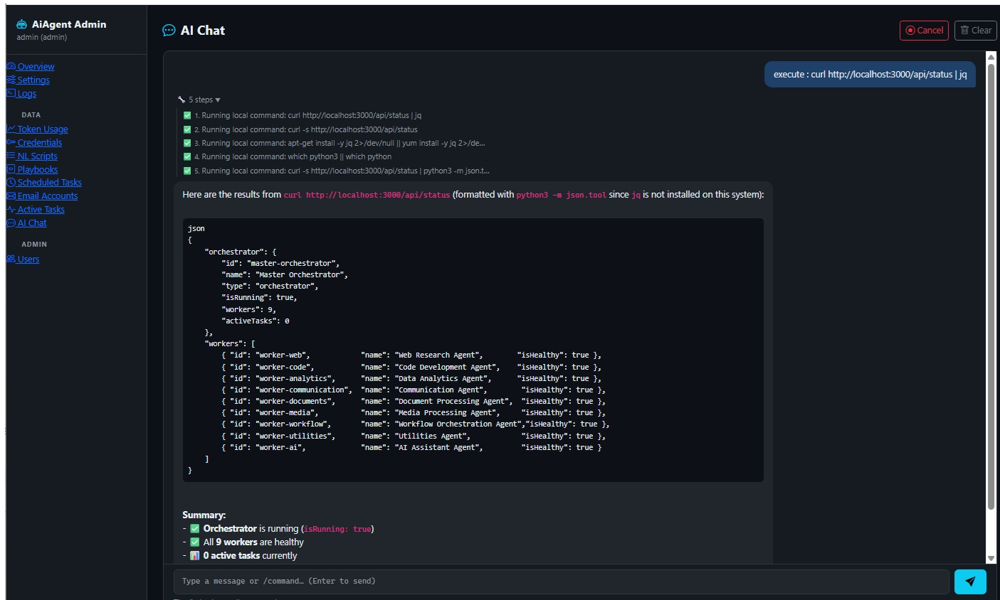
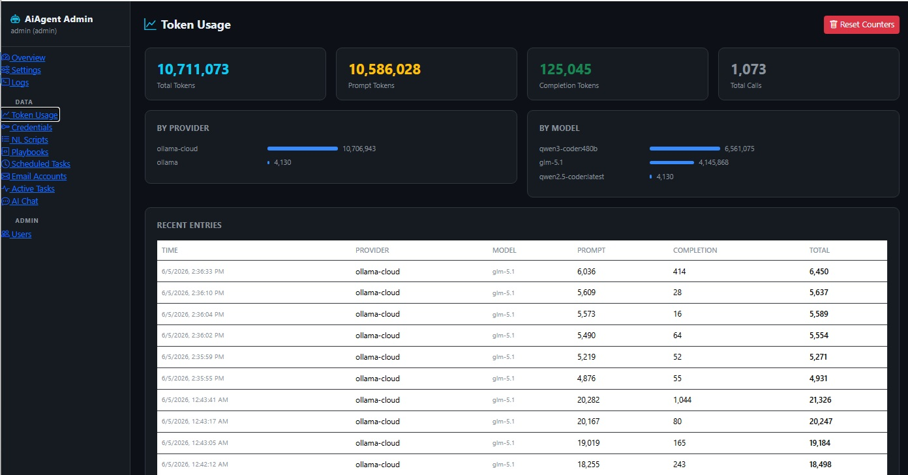
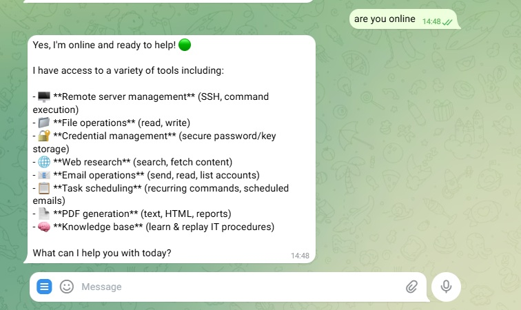
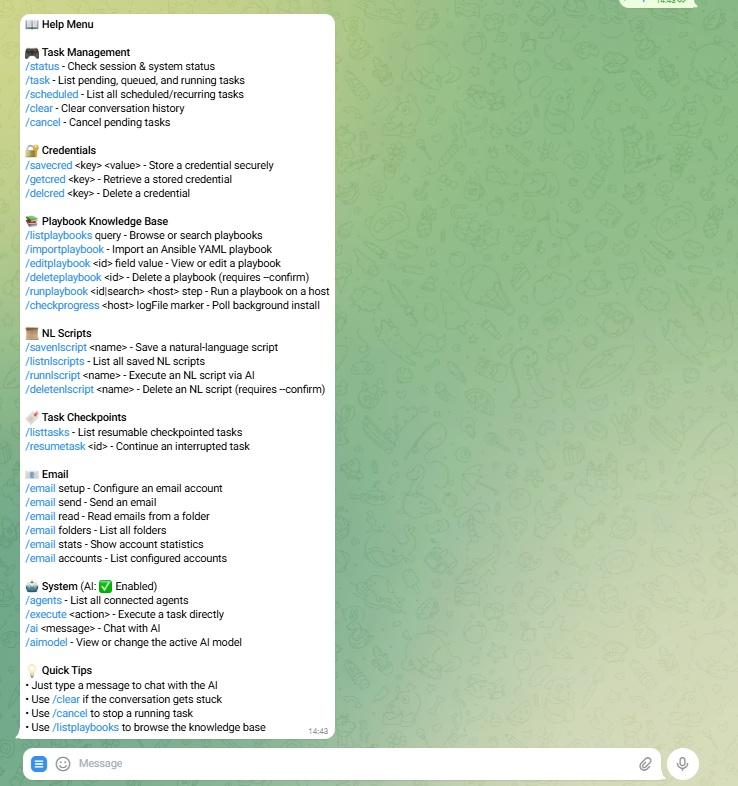
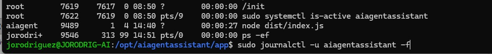

# AI Agent Assistant

A production-grade **multi-agent AI orchestration system** with Telegram integration, a web-based Admin Portal, an IT knowledge base, and support for every major AI provider. Built with TypeScript/Node.js and designed to run on any Ubuntu/Debian Linux server.

**Author:** Jose Rodriguez Arroyo · [jrpcone@gmail.com](mailto:jrpcone@gmail.com) · [github.com/jorodriguezpr](https://github.com/jorodriguezpr/)



---

## Table of Contents

- [Features](#features)
- [Quick Install (One Line)](#quick-install-one-line)
- [AI Providers](#ai-providers)
- [Admin Portal](#admin-portal)
- [Telegram Bot Commands](#telegram-bot-commands)
- [Natural Language Scripts (NL Scripts)](#natural-language-scripts-nl-scripts)
- [IT Knowledge Base & Playbooks](#it-knowledge-base--playbooks)
- [Architecture](#architecture)
- [Configuration (.env)](#configuration-env)
- [Manual Installation](#manual-installation)
- [Deployment & Updates](#deployment--updates)
- [Troubleshooting](#troubleshooting)

---

## Features

### AI & Agents
- **Multi-provider AI** — Anthropic Claude, OpenAI, GitHub Copilot, Ollama (local), Ollama Cloud, Lemonade; switch providers at runtime
- **140+ AI tools** — SSH remote execution, DNS/network diagnostics, web search, email, PDF generation, file management, credential vault, and more
- **Plan-first execution** — AI proposes a step-by-step plan with dependency graph; user approves before any tool runs
- **Human-in-the-loop (HITL)** — destructive operations (reboots, deletes, rm -rf) require explicit Telegram approval before executing
- **Parallel tool execution** — independent tools run concurrently (`Promise.allSettled`)
- **Context summarization** — auto-compresses conversation history at 50k tokens so long tasks never hit model limits
- **Specialized agents** — SysAdmin, Database, Mail, Monitor agent profiles auto-selected based on request type
- **Task checkpointing** — Redis-backed; resume interrupted tasks with `/resumetask`
- **Up to 240 iterations** per task with configurable continuation

### Interfaces
- **Telegram Bot** — primary interface; live step indicators (⟳→✅/❌) show real-time progress during tool execution
- **Admin Portal** — standalone web UI at port 8085; live chat, .env editor, credential manager, service control, logs, playbooks
- **REST API** — health, status, and task execution endpoints at port 3000

### Knowledge & Automation
- **IT Knowledge Base** — self-learning playbook engine; records successful installs (ISPConfig, CWP, cPanel, KloxoNG, Plesk, HestiaCP, etc.) and reuses them
- **NL Scripts** — save multi-step natural-language procedures and replay them on demand; schedule them as recurring cron tasks
- **Credential vault** — encrypted at-rest credential store with `/savecred` / `/getcred`; portal chat auto-prompts for missing credentials mid-task
- **Scheduled tasks** — cron-based task scheduling; supports email, shell commands, and NL scripts

---

## Quick Install (One Line)

Run this on any Ubuntu 20.04+ / Debian 11+ server as root:

```bash
curl -fsSL https://raw.githubusercontent.com/jorodriguezpr/aiagentassistant/main/gitdeploy/install.sh | bash
```

Or download and inspect first:

```bash
wget https://raw.githubusercontent.com/jorodriguezpr/aiagentassistant/main/gitdeploy/install.sh
chmod +x install.sh
./install.sh
```

The installer will:
1. Install Node.js 20, Redis, Git, and all system dependencies
2. Create the `aiagent` service user at `/opt/aiagentassistant/`
3. Clone the repository and build from source
4. Walk you through an **interactive configuration** (AI provider, Telegram token)
5. Install and enable both systemd services
6. Create the admin portal with a generated admin password
7. Print the portal URL and credentials when done

**Requirements:** Ubuntu 20.04+ or Debian 11+, root access, internet connection.

---

## AI Providers

Configure via `AI_PROVIDER` in `.env` or through the Admin Portal → Settings.

| Provider | `AI_PROVIDER` value | Required env var | Notes |
|----------|---------------------|------------------|-------|
| **Anthropic Claude** ★ | `anthropic` | `ANTHROPIC_API_KEY` | Recommended — best reasoning |
| OpenAI | `openai` | `OPENAI_API_KEY` | GPT-4 Turbo, GPT-4o |
| GitHub Copilot | `github-copilot` | `GITHUB_COPILOT_API_KEY` | Free with Copilot subscription |
| Ollama (local) | `ollama` | — | Needs Ollama running on server |
| **Ollama Cloud** | `ollama-cloud` | `OLLAMA_CLOUD_API_KEY` | Hosted at ollama.com — free tier |
| Lemonade | `lemonade` | — | Local OpenAI-compatible server |

### Recommended models

```env
# Anthropic Claude 2026
AI_MODEL=claude-opus-4-7        # Most capable (default)
AI_MODEL=claude-sonnet-4-6      # Speed/quality balance
AI_MODEL=claude-haiku-4-5       # Fastest, lowest cost

# Ollama Cloud free models
AI_MODEL=llama3.3
AI_MODEL=gemma3
AI_MODEL=phi4
AI_MODEL=mistral

# Local Ollama
AI_MODEL=qwen2.5-coder:latest
AI_MODEL=llama3:latest
```

Change the active model at runtime in Telegram: `/aimodel claude-sonnet-4-6`

---

## Admin Portal



A standalone web application running at **port 8085** over **HTTPS**, accessible from any browser.

```
https://YOUR_SERVER_IP:8085
```

> The installer generates a self-signed TLS certificate. Your browser will show a security warning on first visit — click **Advanced → Proceed** to continue. This is expected for self-signed certs.

### Features

| Section | What you can do |
|---------|-----------------|
| **AI Chat** | Full chat interface with live step indicators; identical AI experience to Telegram. Auto-prompts for missing vault credentials mid-task |
| **Settings** | Edit any `.env` variable (AI provider, model, tokens, feature flags) |
| **Credentials** | Add/view/delete vault credentials used by the AI agent |
| **Service Control** | Start / Stop / Restart the AI agent service |
| **Live Logs** | Stream real-time journald logs from both services |
| **Playbooks** | Browse, search, and view IT knowledge base playbooks |
| **NL Scripts** | View and manage saved natural-language scripts |
| **Scheduled Tasks** | View scheduled/recurring tasks (email, commands, and NL scripts) |
| **Token Usage** | AI token consumption metrics |
| **About** | Developer info and project details |



### Default credentials (set during install)

```
URL:      https://YOUR_SERVER_IP:8085
Username: admin
Password: <generated by installer — shown once at the end>
```

To reset the admin password:
```bash
PORTAL_DATA_DIR=/opt/aiagentassistant/portal \
  node /opt/aiagentassistant/portal/setup.js --username admin --password NEWPASSWORD
```

---

## Telegram Bot Commands



### General

| Command | Description |
|---------|-------------|
| `/start` | Welcome message and quick overview |
| `/help` | List all available commands |
| `/status` | System status: uptime, AI provider, Redis, active tasks |
| `/agents` | List connected worker agents |
| `/cancel` | Cancel a running AI task immediately |

### AI Chat

| Command | Description |
|---------|-------------|
| *(any message)* | Chat with the AI agent — just send natural language |
| `/ai <message>` | Explicit AI chat (same as sending a plain message) |
| `/aimodel [model]` | View current model or switch: `/aimodel claude-sonnet-4-6` |
| `/clear` | Clear conversation history and start fresh |

### Task Management

| Command | Description |
|---------|-------------|
| `/task` | Show active and pending tasks |
| `/listtasks` | List all resumable checkpointed tasks |
| `/resumetask [taskId]` | Resume an interrupted task |
| `/execute <action> [params]` | Execute a specific agent action directly |
| `/scheduled` | List all scheduled/cron tasks |

### Credential Vault

| Command | Description |
|---------|-------------|
| `/savecred <key> <value>` | Save a credential (e.g. `/savecred root@192.168.1.1 mypassword`) |
| `/getcred <key>` | Retrieve a credential value |
| `/delcred <key>` | Delete a credential |

### IT Knowledge Base & Playbooks

| Command | Description |
|---------|-------------|
| `/listplaybooks [search]` | List all playbooks or search by keyword |
| `/runplaybook <name or id>` | Execute a saved IT playbook on a remote server |
| `/checkprogress <host> [logFile]` | Poll background install progress on a remote server |
| `/importplaybook` | Import an Ansible YAML playbook (send YAML inline or after command) |
| `/editplaybook <id> field=value` | Edit playbook metadata (title, description, category, etc.) |
| `/deleteplaybook <id> [--confirm]` | Delete a playbook (shows preview; add `--confirm` to execute) |

### Natural Language Scripts

| Command | Description |
|---------|-------------|
| `/savenlscript <name>` | Save a multi-step NL procedure as a reusable script |
| `/listnlscripts` | List all saved NL scripts |
| `/runnlscript <name>` | Execute a saved NL script via the AI agent |
| `/deletenlscript <name> [--confirm]` | Delete a saved NL script |

### Email

| Command | Description |
|---------|-------------|
| `/email` | Email management menu (configure accounts, read, send) |



---

## Natural Language Scripts (NL Scripts)

NL Scripts let you save a sequence of natural-language steps and replay them on demand — like macros for the AI agent.

**Save a script:**
```
/savenlscript deploy-wordpress
Step 1: Connect to root@192.168.1.50 and update the system
Step 2: Install Apache, PHP 8.2, and MySQL
Step 3: Download WordPress to /var/www/html
Step 4: Set proper file permissions
Step 5: Restart Apache
```

**Run it later:**
```
/runnlscript deploy-wordpress
```

The AI agent reads each step and executes them sequentially, using real tools (SSH, remote commands, etc.) with full live feedback.

**Schedule an NL script to run automatically:**
```
"Schedule the 'weekly-maintenance' NL script to run every Sunday at midnight"
```

The agent creates a scheduled task of type `nlscript`. When it fires, the full AI loop runs the script automatically — no human interaction needed.

---

## IT Knowledge Base & Playbooks

The knowledge base (`experience-kb.json`) is a **self-learning system** that records successful IT procedures during real sessions and makes them reusable.

### How it works

When the AI agent completes a server setup (e.g. installing CWP, ISPConfig, or cPanel), it records every command, the outcome, and notes into a playbook. Future requests for the same task load that playbook first — dramatically reducing mistakes and API usage.

### Built-in playbooks (included after install)

- ISPConfig 3 on Ubuntu 22.04
- CWP (CentOS Web Panel) on AlmaLinux 8
- KloxoNG on AlmaLinux 8
- cPanel/WHM on AlmaLinux 8 (with Proxmox fstab fix)

### Knowledge base location

```
/opt/aiagentassistant/app/data/experience-kb.json
```

> **Important:** Never overwrite this file — always read and merge. It may contain entries not present in the Windows development copy.

---

## Architecture



```
                    ┌─────────────────────────────┐
                    │      Telegram Gateway        │
                    │  Live step indicators (⟳✅❌) │
                    └──────────────┬──────────────┘
                                   │
          ┌────────────────────────┼────────────────────────┐
          │                        │                        │
┌─────────▼────────┐   ┌──────────▼──────────┐   ┌────────▼───────┐
│   Admin Portal   │   │  Master Orchestrator │   │   REST API     │
│   (port 8085)    │   │  Plan→Act→Observe    │   │  (port 3000)   │
│  Chat·Settings   │   │  HITL·Checkpointing  │   │  /health /api  │
│  Logs·Creds      │   │  Context compression │   └────────────────┘
└──────────────────┘   └──────────┬──────────┘
                                   │
              ┌────────────────────┼────────────────────┐
              │                    │                    │
   ┌──────────▼──────┐  ┌─────────▼──────┐  ┌─────────▼──────┐
   │  SysAdmin Agent │  │  Mail Agent    │  │  Monitor Agent │
   │  SSH·Remote·DNS │  │  IMAP·SMTP·PDF │  │  Web·Search    │
   └─────────────────┘  └────────────────┘  └────────────────┘
              │
   ┌──────────▼──────────────────────────────────────┐
   │                 AI Tool Layer (140+ tools)        │
   │  execute_remote_command · ssh_login · dns_lookup  │
   │  web_search · send_email · generate_pdf          │
   │  get_credential · control_panel_status · ...     │
   └──────────▼──────────────────────────────────────┘
              │
   ┌──────────▼──────────────────────────────────────┐
   │            AI Provider (runtime-switchable)       │
   │  Anthropic · OpenAI · GitHub · Ollama · Ollama Cloud │
   └─────────────────────────────────────────────────┘
              │
   ┌──────────▼──────┐   ┌─────────────────────────┐
   │  Redis (6379)   │   │  Experience KB           │
   │  Message bus    │   │  /app/data/experience-   │
   │  Checkpoints    │   │  kb.json (self-learning) │
   │  Task queue     │   └─────────────────────────┘
   └─────────────────┘
```

---

## Configuration (.env)

Located at `/opt/aiagentassistant/app/.env`. Edit directly or via the Admin Portal → Settings.

### Core

```env
NODE_ENV=production
LOG_LEVEL=info                       # debug | info | warn | error
REDIS_URL=redis://localhost:6379
API_PORT=3000
API_HOST=0.0.0.0
```

### AI Provider

```env
AI_PROVIDER=anthropic                # anthropic | openai | github-copilot | ollama | ollama-cloud | lemonade
AI_MODEL=claude-opus-4-7
AI_MAX_TOKENS=2000
AI_TEMPERATURE=0.7

# Anthropic
ANTHROPIC_API_KEY=sk-ant-...
AI_API_KEY=sk-ant-...

# OpenAI
# OPENAI_API_KEY=sk-...

# GitHub Copilot
# GITHUB_COPILOT_API_KEY=github_pat_...

# Ollama local
# OLLAMA_BASE_URL=http://localhost:11434

# Ollama Cloud
# OLLAMA_CLOUD_API_KEY=your_key
# OLLAMA_CLOUD_BASE_URL=https://ollama.com   # optional override

# Lemonade local
# LEMONADE_BASE_URL=http://localhost:8000
```

### Telegram

```env
TELEGRAM_BOT_TOKEN=your_bot_token_here
```

### Optional Gateways

```env
ENABLE_DISCORD=false
DISCORD_BOT_TOKEN=your_discord_token

ENABLE_WHATSAPP=false
WHATSAPP_SESSION_NAME=aiagentassistant
```

### Feature Flags

```env
ENABLE_WEB_SEARCH=true
ENABLE_EMAIL=true
ENABLE_PDF_GENERATION=true
ENABLE_SCHEDULING=true
```

### Agent

```env
ORCHESTRATOR_ID=master-orchestrator
ORCHESTRATOR_NAME=Master Orchestrator
WORKER_AGENTS_COUNT=3
MAX_CONCURRENT_TASKS=10
```

---

## Manual Installation

For custom deployments or development:

### Prerequisites

- Ubuntu 20.04+ / Debian 11+
- Node.js 18+ (`node -v`)
- Redis 6+ (`redis-server --version`)
- npm 9+

### Steps

```bash
# 1. Clone
git clone https://github.com/jorodriguezpr/aiagentassistant.git
cd aiagentassistant

# 2. Install dependencies and build
npm install
npm run build

# 3. Build portal
cd portal && npm install && npm run build && cd ..

# 4. Configure
cp .env.example .env
nano .env   # set AI_PROVIDER, API keys, TELEGRAM_BOT_TOKEN

# 5. Create portal admin user
PORTAL_DATA_DIR=./portal node portal/setup.js --username admin --password yourpassword

# 6. Start services
redis-server &
node dist/index.js &
node portal/dist/server.js &
```

### Systemd (production)

Install the provided service files for automatic start on boot:

```bash
sudo cp gitdeploy/systemd/aiagentassistant.service /etc/systemd/system/
sudo cp gitdeploy/systemd/aiagentassistant-portal.service /etc/systemd/system/
sudo systemctl daemon-reload
sudo systemctl enable --now aiagentassistant aiagentassistant-portal
```

---

## Deployment & Updates

### Deploy updated build to production (from Windows dev machine)

```bash
# Build locally
npm run build

# Deploy to WSL / local Linux
wsl -d "Ubuntu-24.04" -u root bash -c "cp -r /mnt/c/PythonProjects/AiAgentAssistant/dist/* /opt/aiagentassistant/app/dist/ && systemctl restart aiagentassistant && echo done"
```

### Service management

```bash
# Status
systemctl status aiagentassistant
systemctl status aiagentassistant-portal

# Restart
systemctl restart aiagentassistant
systemctl restart aiagentassistant-portal

# Logs (live)
journalctl -u aiagentassistant -f
journalctl -u aiagentassistant-portal -f

# Logs (last 50 lines)
journalctl -u aiagentassistant -n 50
```

### Paths

| Path | Purpose |
|------|---------|
| `/opt/aiagentassistant/app/` | Main application |
| `/opt/aiagentassistant/app/dist/` | Compiled JavaScript (deployed here) |
| `/opt/aiagentassistant/app/.env` | Runtime configuration |
| `/opt/aiagentassistant/app/data/experience-kb.json` | IT knowledge base |
| `/opt/aiagentassistant/portal/` | Admin portal |
| `/opt/aiagentassistant/portal/users.json` | Portal user accounts |
| `/etc/systemd/system/aiagentassistant.service` | Main service file |
| `/etc/systemd/system/aiagentassistant-portal.service` | Portal service file |
| `/etc/sudoers.d/aiagent` | Restricted sudo rules for `aiagent` user |

---

## Troubleshooting

### AI agent not responding in Telegram

```bash
journalctl -u aiagentassistant -n 50
# Check: TELEGRAM_BOT_TOKEN set? AI_PROVIDER and API key correct?
```

### Redis connection errors

```bash
redis-cli ping   # should return PONG
systemctl status redis-server
```

### Portal not loading

```bash
journalctl -u aiagentassistant-portal -n 30
# Check port 8085 is not blocked by firewall
ufw allow 8085
```

### Reset portal password

```bash
PORTAL_DATA_DIR=/opt/aiagentassistant/portal \
  node /opt/aiagentassistant/portal/setup.js --username admin --password NEWPASS
systemctl restart aiagentassistant-portal
```

### Reinstall / update

```bash
curl -fsSL https://raw.githubusercontent.com/jorodriguezpr/aiagentassistant/main/gitdeploy/install.sh | bash
```

The installer detects an existing installation and offers to update it.

---

## Project Structure

```
aiagentassistant/
├── src/
│   ├── core/
│   │   ├── Orchestrator.ts          # Master orchestrator (Plan→Act→Observe loop)
│   │   ├── PlanExecutor.ts          # DAG plan execution + judge verification
│   │   ├── SpecializedAgents.ts     # SysAdmin / Mail / Monitor agent profiles
│   │   ├── WorkerAgent.ts           # Worker agent base
│   │   └── MessageBus.ts            # Redis message bus
│   ├── gateways/
│   │   ├── TelegramGateway.ts       # Telegram bot + live step indicators
│   │   ├── WebChatGateway.ts        # Admin portal chat (SSE)
│   │   ├── DiscordGateway.ts        # Discord bot (optional)
│   │   └── WhatsAppGateway.ts       # WhatsApp (optional)
│   ├── utils/
│   │   ├── AIProvider.ts            # Multi-provider AI abstraction
│   │   ├── AITools.ts               # 140+ tool definitions
│   │   ├── toolDescription.ts       # Human-readable step labels (shared)
│   │   ├── CredentialManager.ts     # Vault CRUD
│   │   ├── NLScriptManager.ts       # NL script save/run/list
│   │   └── TaskCheckpoint.ts        # Redis checkpointing
│   ├── knowledge/
│   │   └── ExperienceKnowledgeBase.ts  # Self-learning playbook engine
│   ├── skills/                      # Skill modules (email, SSH, PDF, search, …)
│   └── index.ts                     # Entry point
├── portal/
│   ├── src/                         # Portal TypeScript source
│   ├── public/                      # Static HTML/CSS/JS
│   └── setup.js                     # Initial admin user creation
├── gitdeploy/
│   ├── install.sh                   # One-line interactive installer
│   ├── systemd/                     # Service unit files
│   ├── config/                      # Sudoers, etc.
│   └── scripts/                     # Startup wrappers
├── data/
│   └── experience-kb.json           # IT knowledge base (do not overwrite)
├── package.json
├── tsconfig.json
└── .env.example
```

---

## License

MIT — see LICENSE for details.
